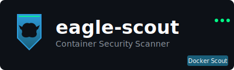

# eagle-scout

<p align="center">
  
</p>

**MCP Server for Docker Scout** - Container security scanning via Model Context Protocol.

[](https://github.com/ry-ops/eagle-scout/actions/workflows/ci.yml)
[](https://github.com/ry-ops/eagle-scout/releases/tag/v1.2.2)
[](https://hub.docker.com/r/ryops/eagle-scout)

Part of the [ry-ops](https://github.com/ry-ops) fabric ecosystem.

## How It Works

<p align="center">
  
</p>

eagle-scout acts as a bridge between AI assistants and Docker Scout, translating natural language requests into security scans and returning structured results.

## Features

- **CVE Scanning** - Scan container images for vulnerabilities
- **Quick Overview** - Get instant security summaries
- **Image Comparison** - Diff two images for security changes
- **SBOM Generation** - Software Bill of Materials in SPDX/CycloneDX
- **Recommendations** - Base image update suggestions
- **Policy Evaluation** - Check images against security policies
- **Attestations** - Manage supply chain attestations
- **VEX Management** - Vulnerability Exploitability eXchange
- **Environment Management** - List and set Scout environments
- **Cache Management** - Manage local Scout cache
- **Continuous Monitoring** - Enable/disable Scout watch

## Prerequisites

- Docker Desktop 4.17+ (includes Docker Scout)
- Or: Docker Engine + Docker Scout CLI plugin

## Installation

### Docker (recommended)

Multi-arch images are published for `linux/amd64` and `linux/arm64` — works natively on Intel and Apple Silicon.

```bash
docker pull ryops/eagle-scout:1.2.2
```

Also available on GitHub Container Registry:

```bash
docker pull ghcr.io/ry-ops/eagle-scout:1.2.2
```

### From Source

```bash
go install github.com/ry-ops/eagle-scout/cmd/eagle-scout@latest
```

### Binary Release

Download from [Releases](https://github.com/ry-ops/eagle-scout/releases/tag/v1.2.2) — available for Linux, macOS, and Windows (amd64/arm64).

## Usage

### Claude Desktop

Add to `~/Library/Application Support/Claude/claude_desktop_config.json`:

```json
{
  "mcpServers": {
    "eagle-scout": {
      "command": "docker",
      "args": ["run", "-i", "--rm", "-v", "/var/run/docker.sock:/var/run/docker.sock", "ryops/eagle-scout:1.2.2"]
    }
  }
}
```

Or with a local binary:

```json
{
  "mcpServers": {
    "eagle-scout": {
      "command": "eagle-scout"
    }
  }
}
```

## MCP Tools

| Tool | Description |
|------|-------------|
| `scout_cves` | Scan image for CVEs with severity filtering |
| `scout_quickview` | Quick security overview of an image |
| `scout_compare` | Compare two images for security differences |
| `scout_sbom` | Generate SBOM (SPDX, CycloneDX, JSON) |
| `scout_recommendations` | Get base image update suggestions |
| `scout_policy` | Evaluate images against security policies |
| `scout_attestation` | Manage attestations on images |
| `scout_repo` | Enable/disable Scout on repositories |
| `scout_vex` | Manage VEX statements (add/list) |
| `scout_environment` | Manage environments (list/set) |
| `scout_cache` | Manage local cache (df/prune) |
| `scout_enroll` | Enroll organization with Docker Scout |
| `scout_watch` | Enable/disable continuous monitoring |

## Examples

### Scan an image for CVEs

```
> Use scout_cves to scan ryops/aiana:latest for critical vulnerabilities
```

### Compare image versions

```
> Use scout_compare to see what changed between ryops/aiana:v1.0.0 and ryops/aiana:latest
```

### Generate SBOM

```
> Use scout_sbom to generate a CycloneDX SBOM for my-app:latest
```

### Get update recommendations

```
> Use scout_recommendations to see if there's a better base image for my-app:latest
```

## CI/CD

All pushes to `main` run through security gates before publishing:

- **Build & Test** - Compile and run tests
- **Security Scan** - Docker Scout CVE scanning (blocks on critical/high CVEs)
- **Policy Check** - Non-root user, no secrets, minimal attack surface
- **Multi-arch Verify** - Validates linux/amd64 and linux/arm64 builds

On merge to `main`, multi-arch images are published to Docker Hub and GHCR. Version tags (`v*`) trigger full releases with binaries for 5 platforms.

## Fabric Ecosystem

eagle-scout is part of the ry-ops fabric:

| Fabric | Language | Role |
|--------|----------|------|
| [git-steer](https://github.com/ry-ops/git-steer) | TypeScript | GitHub repo management |
| [aiana](https://github.com/ry-ops/aiana) | Python | Semantic memory |
| [n8n-fabric](https://github.com/ry-ops/n8n-fabric) | Python | Workflow automation |
| **eagle-scout** | Go | Container security |

## Development

```bash
# Clone
git clone https://github.com/ry-ops/eagle-scout
cd eagle-scout

# Build
go build -o eagle-scout ./cmd/eagle-scout

# Run
./eagle-scout

# Test
go test ./...
```

## License

MIT License - see [LICENSE](LICENSE) file.

---

**Docker Hub:** [ryops/eagle-scout](https://hub.docker.com/r/ryops/eagle-scout) | **GHCR:** [ghcr.io/ry-ops/eagle-scout](https://github.com/ry-ops/eagle-scout/pkgs/container/eagle-scout)

**Version:** 1.2.2
