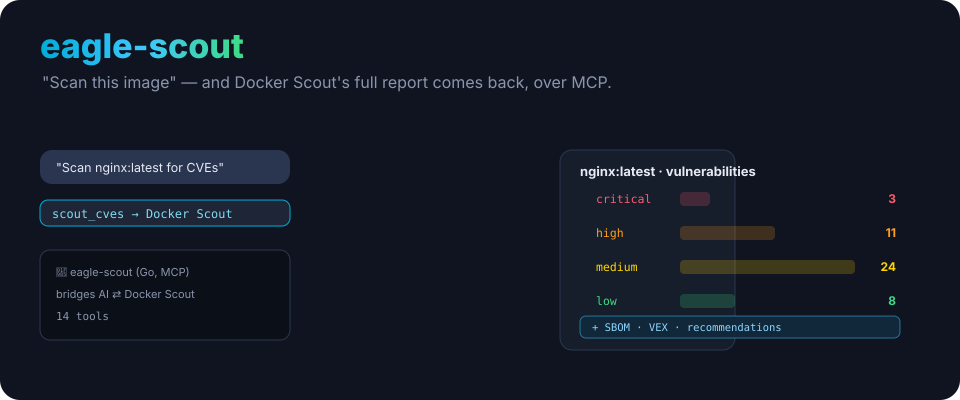
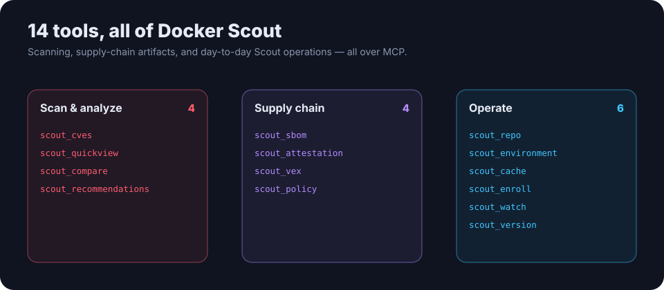

<p align="center">
  
</p>

<h1 align="center">🦅 eagle-scout</h1>

<p align="center"><b>Docker Scout container security, over MCP.</b> A Go MCP server that bridges AI assistants and Docker Scout — ask in plain language, and it runs the scan and returns structured results.</p>

<p align="center">
  <a href="https://github.com/ry-ops/eagle-scout/actions/workflows/ci.yml"></a>
  <a href="https://go.dev/"></a>
  
  <a href="https://hub.docker.com/r/ryops/eagle-scout"></a>
  <a href="LICENSE"></a>
</p>

---

## What it does

eagle-scout turns natural-language requests into Docker Scout commands and returns structured results — CVEs by severity, SBOMs, image diffs, policy verdicts and supply-chain artifacts — all without leaving your AI assistant.

## The 14 tools

<p align="center">
  
</p>

| Group | Tools |
|---|---|
| **Scan & analyze** | `scout_cves`, `scout_quickview`, `scout_compare`, `scout_recommendations` |
| **Supply chain** | `scout_sbom` (SPDX/CycloneDX), `scout_attestation`, `scout_vex`, `scout_policy` |
| **Operate** | `scout_repo`, `scout_environment`, `scout_cache`, `scout_enroll`, `scout_watch`, `scout_version` |

## Quick start

**Prerequisites:** Docker with the [Scout CLI plugin](https://docs.docker.com/scout/), and a logged-in Docker account for registry-backed features.

```bash
docker run --rm -i \
  -v /var/run/docker.sock:/var/run/docker.sock \
  ryops/eagle-scout:latest
```

Or build from source (Go 1.25):

```bash
git clone https://github.com/ry-ops/eagle-scout.git
cd eagle-scout
go build ./cmd/eagle-scout
```

**Connect Claude Desktop** — add to `claude_desktop_config.json`:

```json
{
  "mcpServers": {
    "eagle-scout": {
      "command": "docker",
      "args": ["run", "--rm", "-i", "-v", "/var/run/docker.sock:/var/run/docker.sock", "ryops/eagle-scout:latest"]
    }
  }
}
```

Then ask: *"Scan nginx:latest for critical CVEs,"* *"Generate an SBOM for my-app:1.2,"* or *"Compare my-app:1.1 and my-app:1.2."*

## More

A Docker Desktop extension, CI/release workflows and security policy live in the repo; see [CHANGELOG.md](CHANGELOG.md) and [CONTRIBUTING.md](CONTRIBUTING.md). Part of the [ry-ops](https://github.com/ry-ops) fabric ecosystem.

## License

MIT. See [LICENSE](LICENSE).

<!-- org-footer -->
---

<p align="center"><sub>Part of <a href="https://github.com/ry-ops">ry-ops</a> · building the pipes between infrastructure, automation, and observability · built by <a href="https://github.com/ry-ops">ry-ops</a></sub></p>
